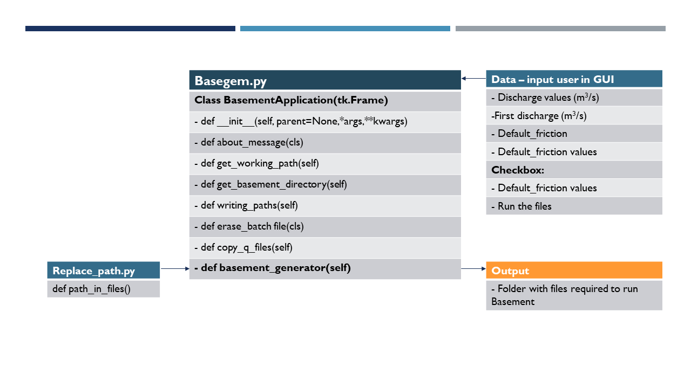
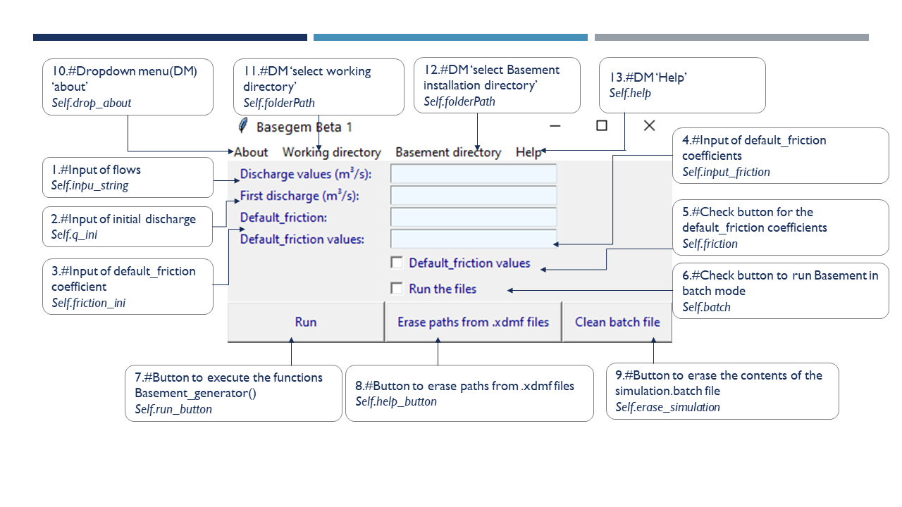

# Basegem Beta 1

---


`Basegem beta 1` is an application that complements the package `Aquafuzzy` in such a way
that Habitat Suitability of a river section could be assessed under different flow
regimes. 

This application aims to provide a tool that allows a quicker operation of the 
software Basement when it comes to run different scenarios with different flow and 
friction values.

`Basegem beta 1` works with 3 main files from Basement:
* **model.json:** Contains the setup of the hydraulic model. It has to be made with Basement in advance.
  This file will be refered from now on as `initial 'model.json' file`. It is vital that the `Simulation_name` of the file is equal to `mySim` 
* **simulation.json:** Contains the time steps, and the  results that the User wants Basement to calculate, such us water velocities and depths.
  This file is provided in the `Basegem beta 1` App folder, and it can be modified by the User.
* **results.json:** Contains the `.xdmf` output file format which is also provided in the `Basegem
beta 1` App folder.

What the application does is to copy the `results.json` and `simulation.json` files from *the App folder* to a new folder 
which is selected by the User. Then reproduces new `model.json` files, based on the `initial 'model.json' file` 
with new discharge values and/or default_friction values that are typed in the GUI entry boxes of the App.
Subsequently, moves them into new folders created for each one, where the `results.json` and `simulation.json` files are
also copied in.

Based on the stated above, a batch file called `Simulation_base.bat` is created with instructions to run Basement
in batch mode. Finally, once the running of Basement is finished, the paths of every output `.xdmf` file are deleted, so
they can be visualized either with `Paraview` or `Qgis` and converted into raster.tiff maps for the `Aquafuzzy` package.

*Note: The main folder contains a tutorial document called `Basegembeta1_Tutorial.pdf` which can also be accessed through the help menu
from the Graphical User Interfase (GUI)*


## Data and code structure

----
`Basegem beta 1` consists of 3 python scripts:

* **basegem.py** : Main script, containing the App GUI and the *basement_generator()* function.
* **replace_path.py**: *path_in_files()* function, deletes the directory paths from .xdmf files. 
* **decorators.py**: *time_func()* and *change_name()*  wrappers, calculates the running time of other function
  and  changes the name from 'model_copy.json' to 'model.json' respectively.
  
### Code diagram<br>



  
### basegem.py

----
The first part of the script contains the code that builts the  Graphical User Interface (GUI)
which is showed below:




The GUI is composed by:

|Element |Description | Comments|
|:--- |:---- |:----| 
|1 | Input of discharges| The User type discharge values e.g 7.50 8.50 9.50 | 
|2 | Input of initial discharge | Value from the initial model.json file | 
|3 | Input of default_friction coefficient| Value from the initial model.json file| 
|4 | Input of default_friction coefficients | Only type when different values are wanted in the new files | 
|5 | Check button for the default_friction coefficients | Only activate when point 4 is true | 
|6 | Check button for the running of Basement in batch mode | Only mark when the immediate running of Basement after the generation of files is required| 
|7 | Run button | Creates folder and files to be runned by Basement if 6. is not marked the Simulation_base.bat  can be ran later | 
|8 | Delete paths from .xdmf files| Delete the paths form .xdmf files  | 
|9 | Clean batch file button | clean the content of the Simulation_base.bat | 
|10 | About | Displays information about the authors | 
|11 | Working directory | The User select the working directory | 
|12 | Basement directory| The User select the installation directory of Basement | 
|13 | Help| Opens the Basegembeta1_Tutorial.pdf document | 

### Entry box
Every *entry box* is linked to a *variable type* and *label* and anchored to the canvas with `grid`.

As for instance, *entry box of element 1, input of discharges,* indicated below as `self.v_input_string`,
is linked to the variable `self.input_string` which is a string variable `tk.StrinVar()`
```python
class BasementApplication(tk.Frame):

    def __init__(self, parent=None, *args, **kwargs):
        tk.Frame.__init__(self, parent, *args, **kwargs)

        # Input of discharges
        self.input_string = tk.StringVar()
        self.a_label = tk.Label(parent, text='Discharge values (m\u00B3/s):',
                                fg='dark blue')
        self.a_label.grid(sticky=tk.W, row=1, column=0, padx=10)

        self.v_input_string = tk.Entry(parent, bg='alice blue', width=15,
                                       textvariable=self.input_string)
        self.v_input_string.grid(stick=tk.EW, row=1, column=1, padx=5)

```
### Buttons
#### Check buttons
The check buttons are linked to boolean variables `tk.BooleanVar()` and are set as `False` which means that
they will remain unmarked unless the User marks them. The name and type of the variable are indicated in first
position.

The check button `self.c_button_batch` is linked to the variable `self.batch`  anchored to the canvas with
`self.c_button_batch.grid()` and set as `False`.

```python
 # Check button for the running of Basement in batch mode
        self.batch = tk.BooleanVar()
        self.c_button_batch = tk.Checkbutton(parent,
                                             text='Run the files',
                                             fg='dark blue',
                                             variable=self.batch)
        self.c_button_batch.grid(stick=tk.W, row=6, column=1)
        self.batch.set(False)
```
#### Push buttons
Push buttons execute functions when they are pressed by the User. For the case below, this action is achieved with
a `lambda` function received in the `command` attribute :  `command= lambda: self.basement_generator()` 

```python
# Button for executing the function Basement_generator
        self.run_button = tk.Button(parent, text='Run',
                                    command=lambda: self.basement_generator(),
                                    fg='dark blue', padx=8, pady=8)
        self.run_button.grid(stick=tk.EW, row=7, column=0)
```
#### Menu bar
In order to receive `drop down menus` the section on the upper part of the canvas is initiate as shown below:

```python
# Menu bar
        self.menu_bar = tk.Menu(self)
        self.parent.config(menu=self.menu_bar)
```
#### Drop down menu

`tearoff` allows creating floating menus. The label `Working directory`  is added to the menu bar with `self.menu_bar.add_cascade`.
When it is pressed, displays  `Working directory`, that executes two functions ` self.get_working_path()` and `self.copy_q_files()`
in that order.

```python
# Drop down menu, 'select working directory'
        self.folderPath = tk.StringVar()
        self.drop_wdirectory = tk.Menu(self, tearoff=0)
        self.menu_bar.add_cascade(label='Working directory',
                                  menu=self.drop_wdirectory)
        self.drop_wdirectory.add_command(label='Working directory',
                                         command=lambda: [
                                             self.get_working_path(),
                                             self.copy_q_files()])
```
### Functions

When `About` is clicked on, it executes the `def about_message(cls)` which only shows  information
about the python project.

The magic method `@classmethod` is implemented.The class method is bound to a class (BasementApplication) instead of its object.
It does not require creation of a class instance.


```python
@classmethod
    def about_message(cls):

        message_text = '''
                        Basegem Beta 1
                        Diego Beramendi Ortega  
                        Yomer Cisneros Aguirre
                        WAREM 2021 - University of Stuttgart '''
        return showinfo('Python Programming for Water Resources ', message_text)

```
When `Working directory` is clicked on, the User select a folder whose path is used to change
the working directory of the App with `os.chdir(working_folder)`

```python


    def get_working_path(self):
        """
        Change the working directory to the one  indicated by the User
        """
        working_folder = filedialog.askdirectory()
        self.folderPath.set(working_folder)
        os.chdir(working_folder)
```

When `Basement directory` is clicked on, the User select the installation folder path of Basement software
(which tipically is:  *C:/Program Files/BASEMENT 3.1.0/bin* e.g.) and is stored in `basement_folder` variable.

```python
    def get_basement_directory(self):
        """
        Get the installation directory of the software Basement
        """
        basement_folder = filedialog.askdirectory()
        self.folderPath_base.set(basement_folder)
```
Righ after selecting the installation path of Basement this information is written in the `backup.txt` file.
Later on, `def basement_generator(self)` will read that path from the text file to write the `Simulation_base.bat` file. 
This avoids the User to select the same installation path every time the app is initiated. 

```python

    def writing_paths(self):
        """
        Write the installation directory of Basement in the 'backup.txt' file
        The mentioned directory is indicated only  once by the User
        """
        with open('backup.txt', mode='w') as f:
            f.write(self.folderPath_base.get())
```
After pressing the `Run` button, Basement run all the created scenarios in batch mode. For that purpose
`def basement_generator(self)` creates a `Simulation_base.bat` with instructions for the running. What 
`def erase_batch_file(cls)` does is to erase those instructions when the `Clean_batch_file` button is clicked on. 

```python

    @classmethod
    def erase_batch_file(cls):
        """
        The content of the Simulation_base.bat is erased when the User press
        the button 'Clean batch file'
        """
        try:
            with open('Simulation_base.bat', mode='r+') as f:
                f.truncate(0)
                print('Simulation_base.bat was cleaned')
        except Exception:
            print('File not found')
            
```

Inside the folder `Basegembeta1` (where this App is stored), there are two fundamental files for the running of Basement:
`Results.json` and `Simulation.json`. These files are copied to the selected `Working directory`. In this respect, as a first step,
the parent directory of the folder where the App is stored is retrieved with `parent_directory=dirname(dirname(abspath(__file__)))` then
those files are copied with `shutil.copy(source, destination)`. The destination is the selected `Working directory` stored in `self.folderPath`

If those files already exist in the `Working directory` (`os.path.isfile()`) then a communication message is displayed.  

```python


    def copy_q_files(self):
        """
        Copy the 'results.json' and 'simulation.json' files from the 
        directory of the App to the indicated working directory
        """

        if os.path.isfile('results.json') and os.path.isfile('simulation.json'):
            print(
                'results.json and simulation.json are already in the selected '
                'working directory')
            pass
        else:
            # get the parent directory of the python file regardless of the
            # current working directory
            parent_directory = dirname(dirname(abspath(__file__)))
            # Copy the results.json and simulation.json files to current
            # working directory
            shutil.copy(parent_directory + '\\basegembeta1\\results.json',
                        self.folderPath.get())
            shutil.copy(parent_directory + '\\basegembeta1\\simulation.json',
                        self.folderPath.get())   
                                
```
The `def basement_generator(self):` function does:

a) Receives the discharge values `input_string = self.input_string.get()` -> convert them into a list (`flows=input_string.split()`)

b) Receives the initial discharge from the `model.json` file stored in `q_ini`.

c) Receives The initial `default_friction` value from the `initial 'model.json'` file -> makes a list out of it(`list_input_friction`) according
to the number of discharges values provided (stored in `input_string`) .

d) Rename the `model.json` file to `model_copy.json`.

e) Data is extracted from the `model_copy.json` and is copied to a new `model.json` (Basement only accepts this name)
inside the working directory.

f) The values from the list of discharges (`flows`) and default_friction (`list_input_friction`) replace the values 
of discharge and default_friction from the `initial 'model.json'` file. 

g) A `New folder` is created under the name **'Q'+ discharge value** (e.g Q9_5). The value 9.5 from the example is
written as 9_5 because Basement does not work well with points in folders names. 

h)`model.json` file is moved to the `New folder` while the `results.json` and `simulation.json` are copied into it.

f) The path of the `New folder` is retrieved since it will be required for the `Simulation_base.bat` file.

g) The `Simulation_base.bat` file is created. For more information on how the batch instructions are written for Basement
refer to  the Basement System Manual, *6.1.3 Batch mode under Windows*, page 32 [*ETH Zurich*'s *BASEMENT*](https://basement.ethz.ch/).

h) If `Run the files ` (In the GUI) is checked then the running in Basement will start `subprocess.call([os.path.abspath('Simulation_base.bat')])`.

i) The function `path_in_files()` from the `replace_path` script is executed .

j) the `model_copy.json` file name is changed into `model.json`. 


```python

@time_func
    def basement_generator(self):
        """
        Generation of json files with different discharge and
        default_friction values.
        Create folders to storage the created files
        together with the simulation and results filesCreates a '.bat' file
        with the instructions to run Basement in Batch mode.

        Parameters
        ----------
        :input_string: STR from  entry box
        :q_ini: STR form tkinter entry box
        :friction_ini: STR from tkinter entry box
        :friction: Boolean, checkbox, if Yes takes into account different
            default_friction-values
        :input_friction: STR from tkinter entry box
        :batch: Boolean, if Yes execute the batch file that contains the running
            instructions of the created files
        """

        # The values must be provided with a space between them
        input_string = self.input_string.get()
        q_ini = self.q_ini.get()
        friction_ini = self.friction_ini.get()
        friction = self.friction.get()

        # The values are converted into a list
        flows = input_string.split()

        # rename the initial model.json to model_coy.json  file in order to
        # get files model.json in the created folders
        os.rename('model.json', 'model_copy.json')

        if friction is True:
            input_dif_friction = self.input_friction.get()
            list_input_friction = input_dif_friction.split()
            pass
        else:
            list_input_friction = []
            for element in range(len(flows)):
                list_input_friction.append(friction_ini)
            pass

        with open('backup.txt', mode='r') as f:
            base_path_intxt = f.readline()

        for i, j in zip(flows, list_input_friction):

            # The gson file originally created is opened
            first_json = 'model_copy.json'

            with open(first_json, 'r') as infile, \
                    open("model.json", 'w') as outfile:
                model_json = infile.read()

                # The variable 'json_flows' receives the flow values of the
                # list
                json_flows = '"discharge": {0}'.format(i)

                # The variable 'json_default_friction' receives the values of
                # friction coefficients of the list
                json_default_friction = '"default_friction": {0}'.format(j)

                # The original discharge is replaced by the values of the
                # provided list
                model_json = model_json.replace(
                    '"discharge": {0}'.format(q_ini), json_flows). \
                    replace('"default_friction": {0}'.format(friction_ini),
                            json_default_friction)

                # The outfile is written
                outfile.write(model_json)
            infile.close()
            outfile.close()

            # The points are replaced by '_' since Basement does not recognize
            # points in folder names
            new_folder = 'Q' + str(i.replace('.', '_'))

            # The new folder is created
            os.makedirs(new_folder)

            # The model.json file modified is moved to the created New folder 
            destination = new_folder
            source = 'model.json'
            shutil.move(source, destination)

            # The simulation and the results file are copied to the
            # respective folders
            shutil.copy('results.json', destination)
            shutil.copy('simulation.json', destination)

            new_folder_path = os.path.abspath(new_folder)

            with open("Simulation_base.bat", 'a') as file:
                string1 = str(
                    '"{0}/BMv3_BASEplane_setup.exe" ^\n-f ' + new_folder_path
                    + '\\model.json ^\n-o ' + new_folder_path
                    + '\\mySim_run.h5\n').format(str(base_path_intxt))
                string2 = str(
                    '"{0}/BMv3_BASEplane_omp.exe" ^\n-f ' + new_folder_path
                    + '\\simulation.json ^\n-r ' + new_folder_path
                    + '\\mySim_run.h5 ^\n-o ' + new_folder_path
                    + '\\mySim_run_results.h5 -p -n 4\n'). \
                    format(str(base_path_intxt))
                string3 = str(
                    '"{0}/BMv3_BASEplane_results.exe" ^\n-f ' + new_folder_path
                    + '\\results.json ^\n-r ' + new_folder_path
                    + '\\mySim_run_results.h5 ^\n-o ' + new_folder_path
                    + '\\mySim_output\nPAUSE\n').format(str(base_path_intxt))

                file.write("%s\n%s\n%s\n" % (string1, string2, string3))

        batch = self.batch.get()

        if batch is True:
            subprocess.call([os.path.abspath('Simulation_base.bat')])
            replace_path.path_in_files()
            pass

        @change_name_file
        def change_json_name(a, b):
            return print('model_copy.json has changed to model.json')

        change_json_name('model_copy.json', 'model.json')

    print(basement_generator.__doc__)


```

### replace_path.py 

-------
It retrieves the folder path and looks for files ending in `.xdmf`. Read the lines of the found files
and erase the paths.

This step is important since is not possible to observe the results of the hydraulic model when there are paths
within the `.xdmf` file there it would not be possible to get raster.tiff maps. 


```python

def path_in_files():
    """
    Delete paths from the .xdmf files in the working directory
    Parameters
    ----------
    :path_base_folders: gets the current working directory
    :content: Read the lines of the .xdmf files in the working directory

    Returns
    --------
    :ouput_remp: replace the paths in the .xdmf files in the working directory

    """
    # Get current directory
    path_base_folders = pathlib.Path().absolute()

    # Find the .xdmf files in the current directory and delete the paths
    for item in path_base_folders.glob('**/*'):
        if item.suffix == '.xdmf':
            with open(item, 'r') as output:
                print(item)
                content = output.readlines()

            with open(item, 'w') as output_remp:
                for line in content:
                    output_remp.write(line.replace(str(item.parent) + '\\', ''))

    return print('The paths from .xdmf files were deleted')


if __name__ == '__main__':
    path_in_files()


```
### decorators.py

----

This script contains 2 wrapper functions, one calculates the executing time of
a function, and the other simply changes the name of a folder. It was made
to change the name of file `model_copy.json` to `model.json` even though it could have been done
without this wrapper. 

```python
def time_func(func):
    """
    Calculate the time of execution of a function
    """
    def wrapper(*args, **kwargs):
        start = time.time()
        result = func(*args, **kwargs)
        end = time.time()
        print(func.__name__, 'took ' + str(round((end - start), 3)) + ' seconds')
        return result

    return wrapper

def change_name_file(func):
    """
    Change the name of the 'model_copy.json' to the 'model.json' file
    """
    def wrapper_change_name_file(arg1, arg2):
        os.rename(arg1, arg2)
        func(arg1, arg2)

    return wrapper_change_name_file
```
## Requirements

---
The libraries used  are the following:

* import os
* import shutil
* import subprocess
* import tkinter as tk
* from decorators import time_func
* from decorators import change_name_file
* from tkinter.messagebox import showinfo
* from tkinter import filedialog
* from os.path import dirname
* from os.path import abspath
* import replace_path
* import pathlib
* import time

`Basegem beta 1` was tested with Basement V3.0 and V3.1 installed in Windows 10. 


## Instructions 

---

1. Create a project folder. 
2. Place the `mesh.2dm` and the `initial 'model.json'` file inside the project folder.
3. Execute the `basegem beta 1` App from the command line (`basegem.py`).
4. Type in the desired flow values in entry box `Discharge values (m^3/s)` ( e.g. 10.50 12.75 15.00).
5. Type in the `First discharge` which is contained within the `initial 'model.json'` file. 
6. Type in the `Default_friction` which is contained within the `initial 'model.json'` file. 
7. If the User wants different `Default_friction` values in the new files, the entry box: `Default_friction values:` has to be filled in with the desired values and
   the check box `Default_friction values` has to be checked.
8. the check box `Run the files` should be checked if the User wants to start with Basement simulation immediately after
generating the files and folders.

If the check box `Run the files` is unchecked then the User can still run the `Simulation_base.bat` 
file by making double click on it. Then in order to erase the paths from the `.xdmf` files, the App
has to be started, the working directory selected and finally `Erase paths from .xdmf files` button has to pressed. 

More information can be found in the `Tutorial.pdf` file. 


### Autors 

---

*Diego Beramendi Ortega*

*Yomer Cisneros Aguirre*

University of Stuttgart

Programming for Water Resources Engineering and Research 

Water Resources Management and Engineering (WAREM) 2021 


