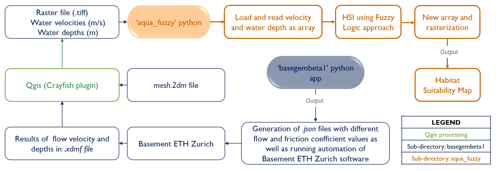

### Automated *Basement* simulation and Habitat Suitability Index using fuzzy logic approach

>   ***Note***: In order to run the codes, please open the given folders (basegembeta1 and aqua_fuzzy) independently. For a better understanding of the code, each folder has its own README file.

This project consists on the automated simulation of hydrodynamic modelling using [*ETH Zurich*'s *BASEMENT*](https://basement.ethz.ch/) software and its subsequent application of resulting (depth and velocity) raster in the estimation of Habitat Suitability Index. The following flow chart illustrates the global code structure:  

#### Automated *Basement* simulation (folder: *basegembeta1*)
In order to facilitate setting the input variables for *`BASEMENT`* simulation, a `Graphical User Interface (GUI)` is used. Wherein, the model runs automatically. The resulting output .xdmf file from the simulation contains information related to water depth and velocity, that is converted to `GeoTIFF` raster format using QGIS `Crayfish` plugin.
#### Habitat Suitability Index using fuzzy logic approach (folder: *aqua_fuzzy*)
>   ***Requirement***: *Python package `SciKit-Fuzzy`*. Please install as `pip install scikit-fuzzy` or follow the [Fuzzy Installation Guide](https://pythonhosted.org/scikit-fuzzy/install.html).

The `velocity` and `water depth` raster files are used in the Habitat Suitability Index (HSI) simulation. Initially, raster files are loaded and read as arrays. Afterwards, HSI value for each pixel is calculated using fuzzy logic. The universe variables and its membership functions are generated according to velocity and water depth. Then, fuzzy rules are applied based on expert knowledge to get HSI values. Finally, the calculated HSI for each pixel is converted to `GeoTIFF` raster format.

