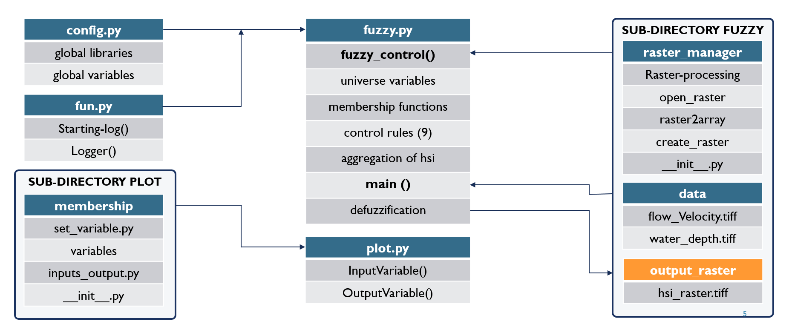
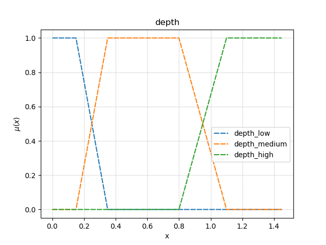
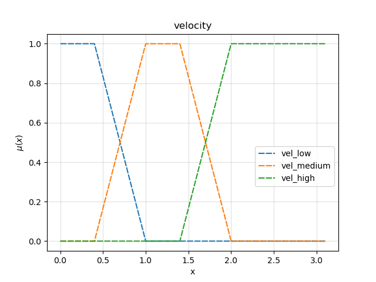
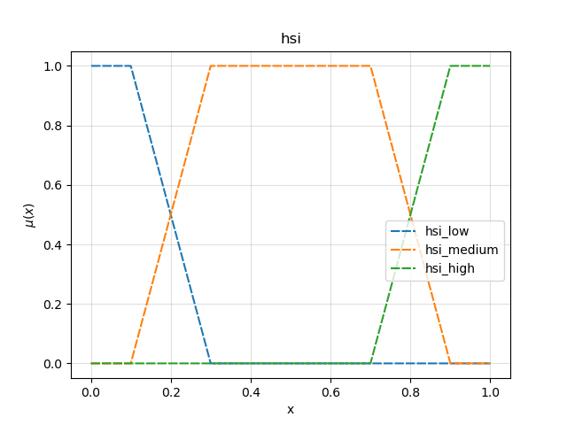
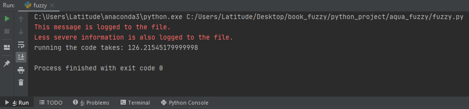
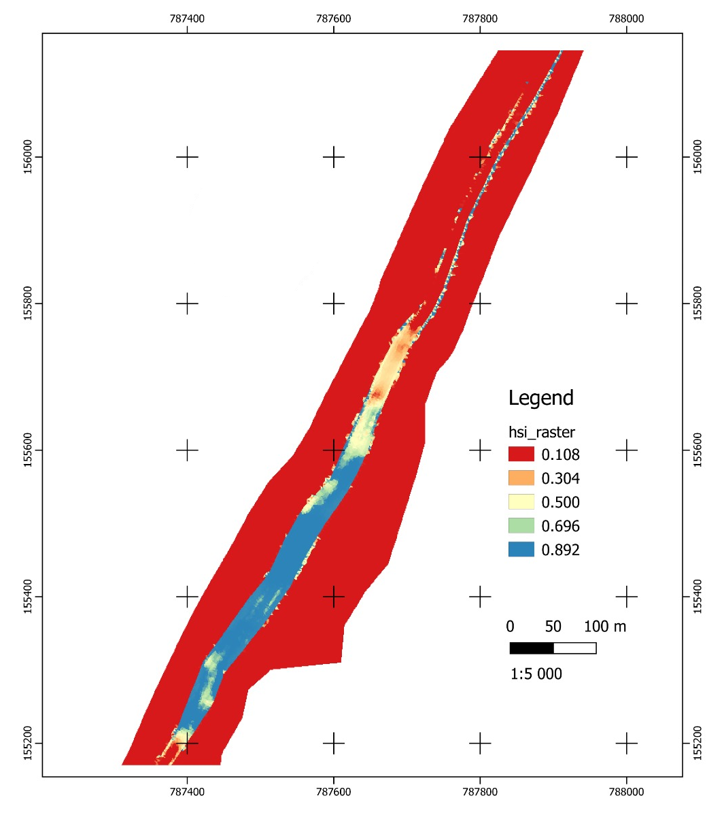

## Habitat Suitability Index using Fuzzy Logic approach

During their life stages, aquatic species need specific habitat preferences, depending on the water depth, velocity, and grain size distribution. Habitat Suitability Index (HSI) describes the quality of physical habitat for a fish at a specific life stage. The combination of hydraulic and morphological HSI values give a *combined Habitat Suitability Index **cHSI***. Many methods are available for combining **HSI** values, here a deterministic method of fuzzy logic will be applied. In this method, each pixel of water depth or flow velocity maps are classified as low, medium, or high qualitative values according to expert knowledge HSI curves. The computation of the **cHSI** value is based on the center of gravity of the aggregated membership functions of the considered parameters ([Yi et al. 2014](https://www.sciencedirect.com/science/article/pii/S0925857414003243)). This section explains the code structure in the calculation of **cHSI** values according to water depth and velocity parameters.
### Data and code structure

### 2D hydrodynamic modelling (folder: **data**)

The folder `/data/`contains `water_depth.tif` and `flow_velocity.tif` rasters to compute the *cHSI* values. Such raster files were generated by [*ETH Zurich*'s *BASEMENT*](https://basement.ethz.ch/) software.
___

### Code

***VISUALIZATION OF MEMBERSHIP FUNCTIONS (folder: **membership**)***<br>

The `/membership/` folder is a package that contains three scripts 
to visualize the membership functions.<br>
The `set_variable.py` script contains the SetFuzzyLogic Class, it creates the trapezoidal shape of membership functions. The Class includes a non public `_adjust` attribute to set the precision of the trapezoids. Then, the class variables are defined using `__init__` method. Afterwards, `__setitem__` and `__getitem__` magic methods are implemented to assign and get the value of the provided items as follows:
```python
# __init__(...) of SetFuzzyLogic class in set_variable.py
    _adjust: int = 5

    def __init__(self, name, min, max, samples):

        self._name = name
        self._min = min
        self._max = max
        self._samples = samples

        self._space = np.linspace(min, max, samples)
        self._sp = np.zeros(self._space.shape)

    def __getitem__(self, x_value):
        return self._sp[np.abs(self._space - x_value).argmin()]

    def __setitem__(self, x_value, dom):
        self._sp[np.abs(self._space - x_value).argmin()] = round(dom, self._adjust) 
```
To make accessible the `_name` non public attribute, `@property` decorator is used. Another interesting decorator `@classmethod` is used to create the trapezoidal shapes of the membership functions. The class method is bound to the class (SetFuzzyLogic) instead of its object. It does not require creation of a class instance.

```python
# __init__(...) of SetFuzzyLogic class in set_variable.py
    @property
    def name(self):
        return self._name

    @classmethod
    def make_trapezoid(cls, name, min, max, samples, w, x, y, z):
    universe = cls(name, min, max, samples)

    with np.errstate(divide='ignore', invalid='ignore'):
        try:
            universe._sp = np.round(np.minimum(np.maximum(np.minimum(
                    (universe._space - w) / (x - w),
                    (z - universe._space) / (z - y)), 0), 1),
                    universe._adjust)
        except FloatingPointError:
            pass

    return universe
```
In order to provide as many required input variables, the class `Variable` was implemented in the `variables.py` file. The non_public attributes are initialized as usual. Then, `add_set`, `get_set` and `add_trepezoid` funtions are defined as shown below:
```python
# __init__(...) of Variable class in variables.py
    @property
    def name(self):
        return self._name

    def _add_set(self, name, sets):
        self._sets[name] = sets

    def get_set(self, name):
        return self._sets[name]

    def add_trapezoid(self, name, w, x, y, z):
        new_membership = SetFuzzyLogic.make_trapezoid(name, self._min_val,
                                                      self._max_val, self._resolution, w, x, y, z)
        self._add_set(name, new_membership)
        return new_membership
        return universe
```
Now, the `plot_variable` function is implemented to visualize the input and output variables:
```python
# __init__(...) of Variable class in variables.py
    def plot_variable(self):
        ax = plt.subplot(111)

        for m, n in self._sets.items():
            ax.plot(n.domain_elements(), n.dom_elements(), label=m, linestyle=(0, (5, 1)))

        ax.grid(True, which='both', alpha=0.4)
        ax.set_title(self._name)
        ax.set(xlabel='x', ylabel='$\mu(x)$')
        ax.legend(loc='upper right', bbox_to_anchor=(1, 0.5), fancybox=True)
        plt.show()
```
The `inputs_output.py` script contains the `InputVariable` and `OutputVariable` sub-classes that inherit from a previously defined class `Variable`:
```python
class InputVariable(Variable):

	def __init__(self, name, min_value, max_value, resolution):
		Variable.__init__(self, name, min_value, max_value, resolution)


class OutputVariable(Variable):

	def __init__(self, name, min_value, max_value, resolution):
		Variable.__init__(self, name, min_value, max_value, resolution)
```
___

***RASTER_MANAGER (folder package: raster_manager)***<br>

A `gdal` functions for processing rasters were implemented in the `raster_manager` folder. The `raster_processing.py` script contains `open_raster`, `raster2array` and `create_raster` functions. The `open_raster` function consists in opening the raster file according to the defined raster band. The `raster2array` function converts the raster to numpy array and overwrite the NoDataValues with np.nan. And the `create_raster` function creates the raster file from numpy array according to the given geotransform and projection.

***CONFIG.PY***<br>
The `config.py` file contains all necessary libraries and global variables that is used in the main function.

***FUN.PY***<br>
The `fun.py` script contains the `logger(fun)` that wraps a function `fun`. Logging starts with the `starting_log` function and is stopped with `logging.shutdown()`.
___
## Visualization code
***PLOT.PY***<br>
The plot script imports `membership` package and uses the `InputVariable` and `OutputVariable` classes to plot the membership functions as shown below:





___
## Main Code
***FUZZY.PY***<br>
The main code of fuzzy logic approach is located in `fuzzy.py` script, and it is based on `SciKit-Fuzzy` python package; therefore, before running the code it is highly recommended to install as `pip install scikit-fuzzy` [Fuzzy Installation Guide](https://pythonhosted.org/scikit-fuzzy/install.html). <br>
The file consists on `fuzzy_control` function that includes the following parts: 
* Definition of universe variables and its membership functions: the universe input and output variables are defined according to `water_depth.tif` and `flow_velocity.tif` rasters. Such variables are implemented as arguments of the `fuzzy_control` function, which will be defined afterwards in the [**standalone statement**]. The membership functions are defined as “low,” “medium,” or "high” qualitative categories according to the extent of the universe variables (x axis). The y axis is called membership degree and ranges from o to 1. The lower bound (0) indicates no membership and the upper bound (1) full membership ([Mocqa et al. 2013](https://www.sciencedirect.com/science/article/pii/S0304380013002834)).
* Fuzzy logic inference according to fuzzy rules: the IF-THEN fuzzy rules are defined according to expert knowledge (e.g. IF depth IS ‘low’ AND velocity IS ‘medium’ THEN hsi IS ‘high’) ([Zhang et al. 2016](https://www.researchgate.net/publication/269775886_Fuzzy_Logic_Method_for_Evaluating_Habitat_Suitability_in_an_Estuary_Affected_by_Land_Reclamation)). It has been used 9 rules according to [Yi et al. 2014](https://www.sciencedirect.com/science/article/pii/S0925857414003243)., as shown in the following table:<br>
 <sub>Table 1. Fuzzy rules based on the expert knowledge method.<br>
 
|Number |Velocity | Depth | hsi (Expert knowledge-based) |
|:---: |:----: |:----:| :----:|
|1. | H | H | L  |
|2. | H | M | M  |
|3. | H | L | L  |
|4. | M | H | H  |
|5. | M | M | H  |
|6. | M | L | L  |
|7. | L | H | L  |
|8. | L | M | M  |
|9. | L | L | L  |
L = low, M = medium, H = High
* Then, the output membership functions are aggregated by taking the minimum degree of memberships among the categories of the two variables (velocity, depth).

The `main()` function contains the defuzzification process of transforming the final fuzzy set into a crisp (real) number which ranges between 0 (unsuitable habitat) to 1 (most suitable habitat) ([Mocqa et al. 2013](https://www.sciencedirect.com/science/article/pii/S0304380013002834)). Initially, the computed control system from the `fuzzy_control` function is loaded, then the velocity and depth rasters are read as arrays in order to iterate each value and perform the defuzzification process. Finally, it is created the hsi raster from the defuzzified `output_hsi` array.<br>
In the `if __name__ == '__main__'` statement, it is defined the universe variables as arguments to `fuzzy_control` function. The global variables `depth_file` and `velocity_file` corresponds to the directory of input `/data/` files. Correspondingly, the `file_name` global variable belongs to the final output `hsi_result` raster, that is located in `output_raster` folder.
## Run the code
A successful run of the script `fuzzy.py` should look like this:
 

Plotted in QGIS, the `hsi_result` raster looks like this (as map layout):
 


 
